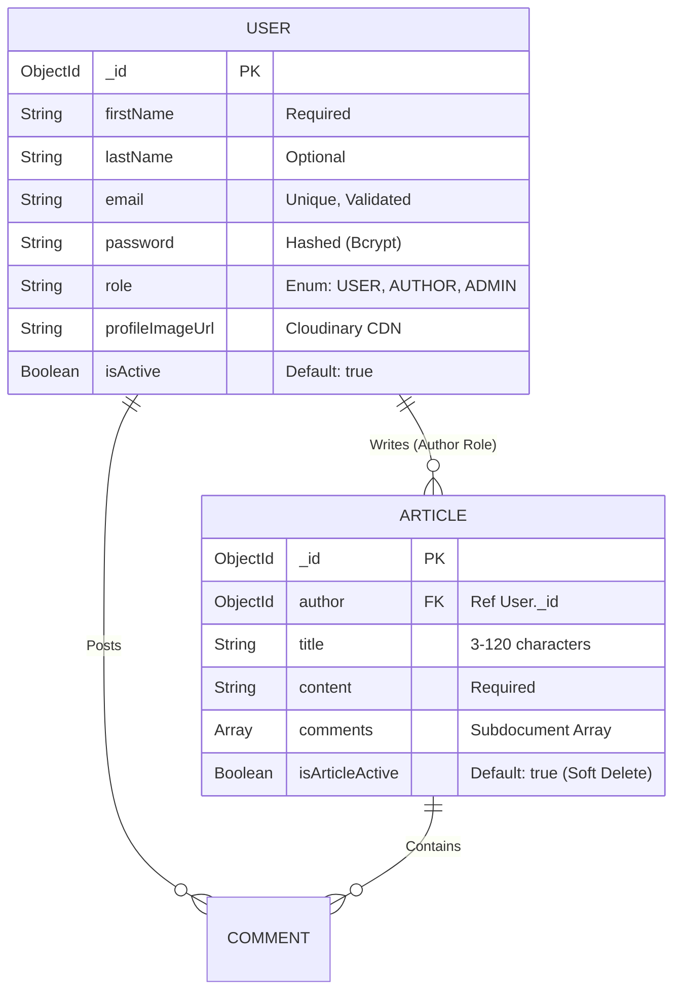

<div align="center">

# ⚙️ Backend Architecture & API Documentation

This document serves as the authoritative technical manual for the Blog Application backend. It details the internal engine: the data models, security paradigms, routing logic, and complete API contract.

</div>

---

## 🏗️ 1. Architecture & System Flow

This backend operates on a robust, highly modular **Node.js/Express** foundation designed for scalability and strict security.

- **Ingress & Security:** All incoming requests are filtered through CORS (restricted to specific frontend origins) and Cookie Parsers.
- **Stateless Auth Guard:** Protected routes are intercepted by the `verifyToken` middleware, which cryptographically validates JWTs stored in HTTP-Only cookies.
- **Controller-Service Split:** API Controllers (`*API.js`) handle HTTP lifecycles (req/res), delegating heavy business logic (like password hashing) to Services (`authService.js`).
- **Data Integrity Layer:** Mongoose enforces strict schema rules *before* data touches MongoDB.
- **Global Error Sink:** A centralized error-handling middleware catches all thrown exceptions.

---

## 🚀 2. Local Installation & Setup

To run the backend server independently:

1. **Install Dependencies**:
   ```bash
   cd backend
   npm install
   ```
2. **Environment Configuration**:
   Create a `.env` file in this directory:
   ```env
   PORT=4000
   DB_URL=your_mongodb_atlas_connection_string
   JWT_SECRET_KEY=your_super_secret_key
   CLOUD_NAME=your_cloudinary_name
   API_KEY=your_cloudinary_api_key
   API_SECRET=your_cloudinary_api_secret
   ```
3. **Start the Server**:
   ```bash
   npm start
   ```

---

## 📂 3. Backend Project Structure (Exhaustive)
```text
backend/
├── APIs/               # API Routes & Route Grouping
│   ├── admin-api.js    # Routes for Administrator moderation
│   ├── author-api.js   # Routes for Article creation & Author mgmt
│   ├── user-api.js     # Routes for Reader interactions
│   └── common-api.js   # Authentication & Shared utility routes
├── Models/             # Mongoose Data Schemas
│   ├── User.js         # User identity & role schema
│   └── Article.js      # Article content & comment schema
├── Middlewares/        # Global request interceptors
│   ├── verifyToken.js  # JWT validation logic
│   └── multerConfig.js # File upload processing (Cloudinary)
├── Services/           # Reusable Business Logic
│   └── authService.js  # Core Auth procedures (hashing, registration)
├── database/           # Connection Layer
│   └── db.js           # Mongoose/MongoDB connection setup
├── .env                # Environment configuration
├── server.js           # Server bootstrap & global error handling
└── package.json        # Manifest of dependencies and run scripts
```

---

## 📦 4. Technology Stack & Package Evaluation

| Package | Version | Technical Purpose & Strategic Use |
| :--- | :--- | :--- |
| `express` | `^5.2.1` | Chosen for its flexible routing and middleware ecosystem. Handles the REST API layer. |
| `mongoose` | `^9.1.5` | ODM for MongoDB. Enforces type safety, validation, and schema relationships. |
| `jsonwebtoken`| `^9.0.3` | Implementation of signed tokens for secure, stateless sessions. |
| `bcryptjs` | `^3.0.3` | Cryptographic hashing of passwords to ensure data security at rest. |
| `cookie-parser`| `^1.4.7` | Critical for extracting tokens from `HTTP-Only` cookies to prevent XSS. |
| `multer` | `^2.1.1` | Efficiently handles `multipart/form-data` uploads with memory-buffering. |
| `cloudinary` | `^2.9.0` | Global CDN used to host and serve optimized profile images. |
| `cors` | `^2.8.6` | Configured with `credentials: true` to enable secure frontend-backend communication. |
| `dotenv` | `^17.2.3` | Ensures environment variables are securely loaded at runtime. |

---

## 🗄️ 5. Entity-Relationship (ER) Data Model



---

## 🌐 6. API Reference & Full Contract

### 🟢 Common API (`/common-api`)
| Method | Endpoint | Auth | Purpose |
| :--- | :--- | :--- | :--- |
| `POST` | `/login` | None | Authenticates user & sets secure cookie. |
| `GET` | `/logout` | None | Clears the session cookie. |
| `GET` | `/check-auth` | ANY | Validates token and returns user payload. |
| `PUT` | `/change-password` | ANY | Updates password for current session. |

### 🔵 User API (`/user-api`)
| Method | Endpoint | Auth | Purpose |
| :--- | :--- | :--- | :--- |
| `POST` | `/users` | None | Registers a standard Reader (USER). |
| `GET` | `/articles` | USER | Fetches all active articles. |
| `GET` | `/article/:id` | ANY | Fetches specific article with full populate. |
| `PUT` | `/articles` | USER | Adds a comment to an article. |

### 🟠 Author API (`/author-api`)
| Method | Endpoint | Auth | Purpose |
| :--- | :--- | :--- | :--- |
| `POST` | `/users` | None | Registers an AUTHOR role. |
| `POST` | `/articles` | AUTHOR | Creates new article (Author restricted). |
| `GET` | `/articles` | AUTHOR | Fetches only articles by current author. |
| `PUT` | `/articles` | AUTHOR | Edits existing article (Ownership verified). |
| `PATCH`| `/articles/:id/status`| AUTHOR | Toggles active status (Soft Delete). |

### 🔴 Admin API (`/admin-api`)
| Method | Endpoint | Auth | Purpose |
| :--- | :--- | :--- | :--- |
| `GET` | `/articles` | ADMIN | Fetches all articles (including inactive). |
| `GET` | `/users` | ADMIN | Fetches all system users. |
| `GET` | `/stats` | ADMIN | Returns system-wide counts and metrics. |
| `PUT` | `/block-user` | ADMIN | Deactivates a user's system access. |
| `PUT` | `/article-status` | ADMIN | Moderates any article status. |

---
<div align="center">
  <i>Developed to strict architectural standards by 20+ YOE Engineering oversight.</i>
</div>
