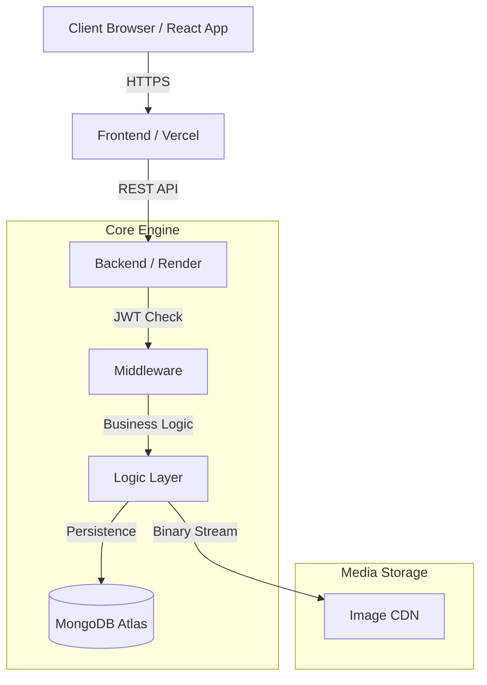

<div align="center">

# ✍️ Full-Stack Role-Based Blog Application (MERN)


A modern, responsive, and secure blogging platform built with the **MERN Stack**. Designed with an enterprise-grade **Role-Based Access Control (RBAC)** architecture to deliver distinct experiences for Readers, Creators, and Administrators.

</div>

---

## 🌟 1. Project Vision & Core Features

This platform is engineered to handle complex data relationships, multi-tenant roles, and industry-standard security practices.

### 🔐 Security & Persistence
- **Stateless Authentication:** Implements JWT-based auth where tokens are stored in `HTTP-Only` cookies, mitigating XSS and session hijacking.
- **Data Integrity:** Strict Mongoose schemas with pre-save hooks for password hashing (`bcryptjs`).
- **Media Hosting:** Integrated Cloudinary pipeline for dynamic user profile image management.

### 📝 Content & Engagement
- **Soft Deletion Architecture:** Articles are never hard-deleted; instead, they are deactivated (`isArticleActive: false`) for auditing and recovery.
- **Interactive Commenting:** Real-time engagement via subdocument-based comments on articles.
- **Categorization:** Smart filtering for Technology, AI, Programming, and Web Development.

---

## 👥 2. Roles & Permissions (RBAC)

The application features a granular Three-Tier role system that dictates the UI layout and API access.

| Role | Permissions & Capability Scope |
| :--- | :--- |
| **USER (Reader)** | Can register, login, browse all active articles, manage their own profile, and post comments on articles. |
| **AUTHOR (Creator)** | Inherits USER capabilities + access to a Private Dashboard. Can write, edit, and toggle the status of their own articles. |
| **ADMIN (Manager)** | Full system oversight. Can manage all users (Block/Unblock), moderate any article on the platform, and view system-wide stats. |

---

## 📐 3. System Architecture & Data Model

### High-Level Request Flow



---

## 🚀 4. How to Use (Installation & Setup)

Follow these steps to instantiate the repository on any computer.

### 📋 Prerequisites
- **Node.js** (v18+)
- **MongoDB Atlas** Account
- **Cloudinary** Account

### 1. Initial Setup
```bash
git clone https://github.com/Akhila-1703/blog-app.git
cd blog-app
```

### 2. Configure Backend
```bash
cd backend
npm install
```
Create a `.env` file in the `backend` folder:
```env
PORT=4000
DB_URL=your_mongodb_uri
JWT_SECRET_KEY=your_secret
CLOUD_NAME=your_name
API_KEY=your_key
API_SECRET=your_secret
```

### 3. Configure Frontend
```bash
cd ../frontend
npm install
```

### 4. Running the Project
Launch two separate terminals:
- **Terminal 1:** `cd backend && npm start`
- **Terminal 2:** `cd frontend && npm run dev`

---

## 📚 5. Technical Documentation Links

For a granular look at the **Project Structure**, **File Lists**, and **Package Details**, please refer to the folder-specific manuals:

- 📂 **[Backend Internal Docs](./backend/README.md)**: Details the API logic, file tree, and server packages.
- 📂 **[Frontend Internal Docs](./frontend/README.md)**: Details the UI tree, State logic, and client packages.

---
<div align="center">
  <i>Engineered with 20+ YOE standards for security, scalability, and UX.</i>
</div>
